# Claude Toolkit Architecture

This document describes the system architecture and component relationships within the Claude Toolkit.

## System Overview

The Claude Toolkit provides a comprehensive approach to managing Claude Code installations and slash commands through five specialized scripts:

- **`claude-toolkit.sh`** - Core infrastructure and shell integration
- **`claude-code.sh`** - Claude Code version management
- **`claude-slash.sh`** - Slash commands management
- **`claude-agents.sh`** - Subagents management
- **`claude-template-sources.sh`** - Template source repositories management

## System Architecture Diagram

```mermaid
graph TD
    A[claude-toolkit.sh] -->|"manages"| D["Toolkit Infrastructure"]
    A -->|"creates"| E["Shell Integration"]
    A -->|"provides"| F["Command Symlinks"]
    
    B[claude-code.sh] -->|"manages"| G["Claude Code Versions"]
    B -->|"handles"| H["Node.js Installation"]
    B -->|"creates"| I["claude wrapper"]
    
    C[claude-slash.sh] -->|"manages"| J["Slash Commands"]
    C -->|"manages"| J1["Command Sources"]
    C -->|"preserves"| K["User Commands"]
    C -->|"caches"| J2["Source Repositories"]
    
    C1[claude-agents.sh] -->|"manages"| J3["Subagents"]
    C1 -->|"manages"| J4["Agent Sources"]
    C1 -->|"preserves"| K1["User Subagents"]
    C1 -->|"caches"| J2["Source Repositories"]
    
    D1[claude-template-sources.sh] -->|"manages"| J1
    D1 -->|"manages"| J4
    D1 -->|"configures"| N1["~/.config/claude-templates/sources.csv"]
    D1 -->|"caches"| N2["~/.cache/claude-templates/"]
    
    D -->|"located in"| L["~/.local/share/claude-toolkit/"]
    G -->|"located in"| M["~/.local/share/claude/versions/"]
    J -->|"located in"| N["~/.claude/commands/"]
    J3 -->|"located in"| N3["~/.claude/agents/"]
    J1 -->|"configured in"| N1["~/.config/claude-templates/sources.csv"]
    J4 -->|"configured in"| N1["~/.config/claude-templates/sources.csv"]
    J2 -->|"cached in"| N2["~/.cache/claude-templates/"]
    
    E -->|"configures"| O["Shell RC Files"]
    F -->|"located in"| P["~/.local/bin/"]
    I -->|"located in"| P
    
    P -->|"added to"| Q["PATH"]
```



## Component Scripts

### Core Infrastructure (`claude-toolkit.sh`)

The toolkit's foundational component that provides:

- **Shell Integration**: Configures PATH and shell environments
- **Symlink Management**: Creates and manages command symlinks
- **Repository Management**: Handles toolkit updates and self-maintenance
- **XDG Compliance**: Follows XDG Base Directory specification

**Key Functions:**
- `install_toolkit()` - Sets up infrastructure and shell integration
- `update_toolkit()` - Updates toolkit from remote repository  
- `validate_toolkit()` - Verifies installation integrity
- `uninstall_toolkit()` - Cleanly removes toolkit infrastructure

**Installation Location**: `~/.local/share/claude-toolkit/`

### Claude Code Management (`claude-code.sh`)

Handles Claude Code lifecycle management:

- **Version Management**: Install, switch between, and remove Claude Code versions
- **Node.js Integration**: Downloads and manages Node.js installations per version
- **Wrapper Scripts**: Creates `claude` command wrapper for easy access
- **Multi-Version Support**: Allows multiple Claude Code versions simultaneously

**Key Functions:**
- `install_claude_code()` - Installs specific Claude Code versions
- `use_claude_code()` - Switches active Claude Code version
- `list_claude_code_versions()` - Lists available/installed versions
- `uninstall_claude_code()` - Removes specific or all versions

**Installation Location**: `~/.local/share/claude/versions/`

### Slash Commands Management (`claude-slash.sh`)

Manages slash commands from multiple sources:

- **Multiple Sources**: Supports commands from various repositories (claude-toolkit, team sources, user commands)
- **Source Management**: Add, remove, and list configured command sources
- **Source-Based Operations**: Install, update, and remove commands by source
- **User Preservation**: Preserves user-created commands during all operations
- **Conflict Resolution**: Handles filename conflicts with stable naming schemes

**Key Functions:**
- `install_templates()` - Installs commands from specified sources
- `list_slash_commands()` - Lists commands with source filtering
- `uninstall_templates()` - Removes commands from specified sources
- `add_template_source()` - Adds new command source repositories
- `remove_template_source()` - Removes source configurations
- `list_template_sources()` - Lists all configured sources

**Installation Location**: `~/.claude/commands/`
**Source Configuration**: `~/.config/claude-templates/sources.csv`
**Repository Cache**: `~/.cache/claude-templates/`

### Subagents Management (`claude-agents.sh`)

Manages subagents from multiple sources:

- **Multiple Sources**: Supports subagents from various repositories (claude-toolkit, team sources, user subagents)
- **Source Management**: Add, remove, and list configured subagent sources (shared with slash commands)
- **Source-Based Operations**: Install, update, and remove subagents by source
- **User Preservation**: Preserves user-created subagents during all operations
- **Conflict Resolution**: Handles filename conflicts with stable naming schemes

**Key Functions:**
- `install_templates()` - Installs subagents from specified sources
- `list_templates()` - Lists subagents with source filtering
- `uninstall_templates()` - Removes subagents from specified sources
- `add_template_source()` - Adds new subagent source repositories (shared function)
- `remove_template_source()` - Removes source configurations (shared function)
- `list_template_sources()` - Lists all configured sources (shared function)

**Installation Location**: `~/.claude/agents/`
**Source Configuration**: `~/.config/claude-templates/sources.csv` (shared with slash commands)
**Repository Cache**: `~/.cache/claude-templates/` (shared with slash commands)

### Template Sources Management (`claude-template-sources.sh`)

Manages template source repository configurations:

- **Source Configuration**: Add, remove, and list git repositories containing commands and subagents
- **Repository Validation**: Validates repository structure and accessibility
- **Cache Management**: Manages repository caches and cleanup
- **Integration Support**: Provides source configuration for claude-slash.sh and claude-agents.sh operations

**Key Functions:**
- `add_template_source()` - Adds new template source repositories (for commands and subagents)
- `remove_template_source()` - Removes source configurations
- `list_template_sources()` - Lists all configured sources
- `validate_repository()` - Validates repository structure and content

**Installation Location**: `~/.config/claude-templates/sources.csv` (configuration)
**Repository Cache**: `~/.cache/claude-templates/` (cached repositories)

## Component Relationships

### Dependency Hierarchy

```
claude-toolkit.sh (foundation)
├── Provides shell integration
├── Creates symlink infrastructure
└── Enables other components

claude-code.sh (requires toolkit)
├── Uses toolkit-provided symlink system
├── Integrates with shell configuration
└── Provides `claude` command

claude-slash.sh (requires toolkit)
├── Uses toolkit-provided infrastructure
├── Manages multiple command sources
├── Caches source repositories
└── Provides slash commands for Claude Code

claude-agents.sh (requires toolkit)
├── Uses toolkit-provided infrastructure
├── Manages multiple subagent sources
├── Caches source repositories (shared with claude-slash.sh)
└── Provides subagents for Claude Code

claude-template-sources.sh (requires toolkit)
├── Uses toolkit-provided symlink system
├── Manages source repository configurations
├── Validates repository structure and content
└── Provides source management for claude-slash.sh and claude-agents.sh
```

### Data Flow

1. **Installation Phase**:
   - `claude-toolkit.sh` creates base infrastructure
   - Shell configuration updated for PATH integration
   - Symlink framework established in `~/.local/bin/`

2. **Claude Code Installation**:
   - `claude-code.sh` downloads and installs Claude Code + Node.js
   - Version-specific directories created
   - `claude` wrapper symlink created/updated

3. **Slash Commands Installation**:
   - `claude-template-sources.sh` manages source repository configurations
   - `claude-slash.sh` uses configured sources for command installation
   - Repository sources cloned/updated to cache directories
   - Commands deployed from sources to `~/.claude/commands/`
   - Source-based classification and conflict resolution
   - User commands preserved across all operations

4. **Subagents Installation**:
   - `claude-template-sources.sh` manages source repository configurations (shared with slash commands)
   - `claude-agents.sh` uses configured sources for subagent installation
   - Repository sources cloned/updated to cache directories (shared with slash commands)
   - Subagents deployed from sources to `~/.claude/agents/`
   - Source-based classification and conflict resolution
   - User subagents preserved across all operations

5. **Template Source Management**:
   - `claude-template-sources.sh` validates and configures git repositories
   - Repository metadata cached in `~/.cache/claude-templates/`
   - Source configurations stored in `~/.config/claude-templates/sources.csv`
   - Integration with `claude-slash.sh` and `claude-agents.sh` for template installation workflows

### Directory Structure

```
~/.local/
├── bin/                           # Executable symlinks (in PATH)
│   ├── claude-toolkit -> ../share/claude-toolkit/scripts/claude-toolkit.sh
│   ├── claude-code -> ../share/claude-toolkit/scripts/claude-code.sh
│   ├── claude-slash -> ../share/claude-toolkit/scripts/claude-slash.sh
│   ├── claude-agents -> ../share/claude-toolkit/scripts/claude-agents.sh
│   ├── claude-template-sources -> ../share/claude-toolkit/scripts/claude-template-sources.sh
│   └── claude -> ../share/claude/current/bin/claude
├── share/
│   ├── claude-toolkit/           # Toolkit infrastructure
│   │   ├── scripts/
│   │   ├── slash-commands/
│   │   ├── agents/
│   │   └── .git/
│   └── claude/                   # Claude Code installations
│       ├── current -> versions/0.0.85/  # Symlink to active version
│       └── versions/
│           ├── 0.0.84/
│           └── 0.0.85/

~/.config/
├── claude-templates/             # Template sources configuration
│   └── sources.csv               # Source repositories configuration (shared by commands and subagents)
└── claude-slash/                 # Slash commands configuration (deprecated)
    └── sources.csv               # Legacy source configuration

~/.cache/
├── claude-templates/             # Template source repositories cache (shared by commands and subagents)
│   ├── abc123.../                # Cached repository (hash-based directory)
│   │   └── claude-toolkit/       # Source name subdirectory
│   └── def456.../                # Another cached repository
│       └── team-alpha/           # Another source
└── slash-commands/               # Legacy cache directory (deprecated)

~/.claude/
├── commands/                     # Slash commands
│   ├── smart-commit.md          # From claude-toolkit source
│   ├── add-command.md           # From claude-toolkit source  
│   ├── deploy.md                # From team-alpha source
│   └── my-custom-command.md     # User command (no source)
└── agents/                       # Subagents
    ├── architect.md             # From claude-toolkit source
    ├── test-writer-debugger.md  # From claude-toolkit source
    ├── deployment-helper.md     # From team-alpha source
    └── my-custom-reviewer.md    # User subagent (no source)
```

## Argument Processing Architecture

All scripts implement a consistent three-stage argument processing pipeline:

### Stage 1: Parse (`parse_arguments()`)
- Pure syntactic parsing without validation
- Returns key-value pairs for all recognized patterns
- Handles flags, options with values, and unknown options

### Stage 2: Validate (`validate_arguments()`)
- Semantic validation of parsed arguments
- Checks for required combinations and constraints
- Returns detailed error messages for issues

### Stage 3: Interpret (`interpret_arguments()`)
- Sets global variables and executes main logic
- Handles default values and environment setup
- Calls appropriate action functions

**Example Flow:**
```bash
./scripts/claude-code.sh install --version 0.0.85 --nodejs-version 18.20.0

# Parse: Extract key-value pairs
command=install, version=0.0.85, nodejs_version=18.20.0

# Validate: Check version format, Node.js compatibility
# All validations pass

# Interpret: Set globals, call install_claude_code()
```

## Security Model

### Isolation Principles

- **User-Space Only**: No system-wide modifications or sudo required
- **XDG Compliance**: Follows standard directory conventions
- **Reversible Operations**: All installations can be cleanly removed
- **Path Isolation**: Components install to separate directories

### Permission Model

- **File Ownership**: All files owned by installing user
- **Directory Permissions**: Standard user permissions (755/644)
- **No Elevated Privileges**: No sudo or system administrator access required

### Network Security

- **HTTPS/SSH Options**: Support for both authentication methods
- **Token-Based Auth**: Secure token authentication for HTTPS
- **VPN Compatibility**: Works with Apple's internal network setup

## Error Handling and Validation

### Validation Layers

1. **Argument Validation**: Command-line argument syntax and semantics
2. **Environment Validation**: System prerequisites and permissions  
3. **Installation Validation**: Post-installation integrity checks
4. **Runtime Validation**: Ongoing operation verification

### Error Recovery

- **Atomic Operations**: Installation steps that can be safely retried
- **Rollback Capabilities**: Failed installations cleaned up automatically
- **State Validation**: Regular integrity checks with repair options
- **Debug Support**: Comprehensive logging for troubleshooting

## Testing Architecture

### Test Organization

```
tests/
├── unit/                        # Individual function testing
│   ├── test-*-argument-parsing.sh
│   └── test-*-functions.sh
├── integration/                 # End-to-end workflow testing  
│   ├── test-*-install.sh
│   ├── test-*-uninstall.sh
│   └── test-*-use.sh
└── utils/                      # Testing infrastructure
    ├── test-harness.sh         # Test framework
    ├── assertion-utils.sh      # Assertion functions
    ├── sandbox-utils.sh        # Isolated test environments
    └── file-utils.sh           # File operations
```

### Sandbox Isolation

- **Complete Isolation**: Tests run in temporary directories
- **Environment Simulation**: Mock shell configurations and PATH
- **Command Masking**: Simulate missing system commands
- **Cleanup Automation**: Automatic cleanup prevents test pollution

## Performance Characteristics

### Installation Performance

- **Parallel Operations**: Where possible, operations run concurrently
- **Caching Strategy**: Downloaded assets cached for reuse
- **Incremental Updates**: Only changed components updated
- **Network Optimization**: Efficient git operations and downloads

### Runtime Performance  

- **Symlink Performance**: Fast command resolution through symlinks
- **Lazy Loading**: Components loaded only when needed
- **Minimal Overhead**: Lightweight wrapper scripts
- **Shell Integration**: Native shell performance for PATH resolution

## Extension Points

### Adding New Components

1. **Script Creation**: Create new management script
2. **Symlink Integration**: Add symlink to toolkit infrastructure
3. **Argument Processing**: Implement standard argument pipeline  
4. **Testing**: Add comprehensive test suite

### Custom Installation Paths

- **XDG Variables**: Override `XDG_DATA_HOME`, `XDG_BIN_DIR`, etc.
- **Environment Customization**: Support for custom directory structures
- **Shell Configuration**: Automatic integration with custom paths

## Related Documentation

- **[Installation Guide](installation.md)** - Complete setup instructions
- **[Claude Code Management](claude-code/index.md)** - Detailed claude-code.sh usage
- **[Slash Commands Management](claude-slash/index.md)** - Detailed claude-slash.sh usage
- **[Subagents Management](claude-agents/index.md)** - Detailed claude-agents.sh usage
- **[Template Sources Management](claude-template-sources/index.md)** - Detailed claude-template-sources.sh usage
- **[User Guide](index.md)** - Advanced usage and integration examples
