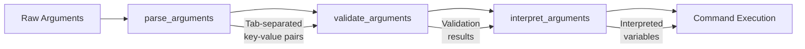

# Argument Processing Architecture

The `claude-code.sh` script implements a sophisticated argument processing system based on functional programming principles, providing clear separation of concerns and robust error handling.

## Architecture Overview

The argument processing follows a clean four-stage pipeline:



## Function Responsibilities

### 1. parse_arguments() - Syntactic Parsing

**Purpose**: Pure syntactic parsing with no validation or interpretation logic.

**Input**: Raw command line arguments (`"$@"`)

**Output**: Tab-separated key-value pairs representing parsed elements

**Key Features**:
- **Pure Function**: No side effects, deterministic output
- **Error-Free**: Never fails - captures all syntax in structured format
- **Command Detection**: Extracts command if present or marks missing with `no_command`
- **Option Parsing**: Handles both `--option value` and `--option=value` syntax
- **Error Markers**: Special markers for missing values (e.g., `version_no_value`)

**Example Output**:
```
command	install
version	1.0.0
shell	bash
debug	true
```

### 2. validate_arguments() - Semantic Validation

**Purpose**: Validates parsed arguments for logical consistency and command-specific requirements.

**Input**: Tab-separated key-value pairs from `parse_arguments` (via stdin)

**Output**: Success (exit 0) or validation errors (exit 1) with detailed messages

**Key Features**:
- **Help Bypass**: Help requests skip all other validation
- **Command Validation**: Ensures recognized commands (`install`, `uninstall`, `reinstall`, `use`, `list`)
- **Context-Aware Validation**: Different rules for different commands
- **Option Restrictions**: Command-specific option validation (e.g., `--all` only for `uninstall`)
- **Shell Support**: Validates supported shells (`bash`, `zsh`, `fish`)
- **Clean Error Messages**: Direct error output with no prefixes

**Validation Rules**:
- `--mode` option only valid for `list` command
- `--all` flag only valid for `uninstall` command  
- Shell must be one of: `bash`, `zsh`, `fish`
- Commands must be recognized: `install`, `uninstall`, `reinstall`, `use`, `list`

### 3. interpret_arguments() - Variable Assignment

**Purpose**: Converts validated parsed arguments into environment variables for command execution.

**Input**: Tab-separated key-value pairs from `parse_arguments` (via stdin)

**Output**: Command execution with properly set variables

**Key Features**:
- **Default Assignment**: Sets sensible defaults for all variables
- **Environment Integration**: Updates global variables (`DEBUG`, `DRY_RUN`)
- **Help Handling**: Processes help requests and exits appropriately
- **Command Dispatch**: Routes to appropriate command functions
- **Trap Isolation**: Uses subshell to isolate command execution

**Variable Mapping**:
```bash
# Default initialization
command=""
version=""
nodejs_version="$NODEJS_VERSION"  # From global config
shell=""
mode="available"
all_flag=false
dry_run="$DRY_RUN"
porcelain="$PORCELAIN" 
debug="$DEBUG"
help_requested=false
```

### 4. main() - Pipeline Orchestration

**Purpose**: Coordinates the entire argument processing pipeline with proper error handling.

**Flow**:
1. **Parse**: Call `parse_arguments "$@"`
2. **Validate**: Pipe parsed output to `validate_arguments`
3. **Error Handling**: Format and display validation errors using `log_error`
4. **Interpret**: Pipe parsed output to `interpret_arguments` for execution

**Error Handling**:
- Validation errors are captured and formatted with `log_error`
- Usage information provided on validation failures
- Clean exit codes (0 for success, 1 for validation errors)

## Key Architectural Benefits

### Separation of Concerns
- **Parsing** handles only syntax extraction
- **Validation** handles only semantic correctness  
- **Interpretation** handles only variable assignment and execution
- **Main** handles only coordination and error formatting

### Testability
- Each function can be tested independently
- Pure functions (parsing) are easily unit testable
- Validation logic is isolated and predictable
- Integration testing focuses on pipeline coordination

### Error Handling
- **Parsing**: Never fails, captures errors as structured data
- **Validation**: Provides specific, actionable error messages
- **Interpretation**: Clean variable assignment with default fallbacks
- **Main**: Consistent error formatting and user feedback

### Maintainability
- Adding new options only requires changes to parsing and validation
- Command-specific logic is cleanly separated
- Error messages are centralized and consistent
- Function contracts are clear and well-defined

## Internal Data Format

The intermediate data format uses tab-separated key-value pairs for several reasons:

### Why Tab-Separated Format
- **Simplicity**: Easy to generate and parse with bash tools
- **Robustness**: Handles spaces in values without complex quoting
- **Stream Processing**: Works naturally with bash `read` loops
- **Debugging**: Human-readable for troubleshooting

### Key Naming Conventions
- **Direct Mapping**: Most keys map directly to option names (`version`, `shell`, `mode`)
- **Boolean Flags**: Options without values become `key\ttrue` pairs
- **Error Markers**: Special suffixes for error conditions (`version_no_value`, `unknown_option`)
- **State Markers**: Special keys for state tracking (`no_command`, `help`)

### Example Transformations

**Input**: `install --version 1.0.0 --debug --invalid-option`

**Parse Output**:
```
command	install
version	1.0.0
debug	true
unknown_option	--invalid-option
```

**Validation Result**: Exit code 1 with error message "Unknown option --invalid-option"

## Testing Strategy

### Unit Testing (parse_arguments, validate_arguments)
- **Boundary Cases**: Empty input, missing values, help flags
- **Option Combinations**: Valid and invalid combinations
- **Error Conditions**: Unknown options, missing commands
- **Format Validation**: Ensure consistent output format

### Integration Testing (main function)
- **End-to-End Flow**: Complete argument processing pipeline
- **Error Propagation**: Validation errors reach user correctly
- **Dry-Run Integration**: DRY_RUN environment variable handling
- **Command Dispatch**: Verify correct function calls with proper arguments

## Future Extensions

### Adding New Options
1. **Parse**: Add option handling to `parse_arguments`
2. **Validate**: Add validation rules to `validate_arguments` 
3. **Interpret**: Add variable assignment to `interpret_arguments`
4. **Test**: Add comprehensive test coverage

### Adding New Commands
1. **Parse**: No changes needed (generic command handling)
2. **Validate**: Add command to validation list
3. **Interpret**: Add command dispatch case
4. **Implement**: Create command function following established patterns

This architecture provides a solid foundation for robust command-line argument processing while maintaining clarity, testability, and extensibility.
