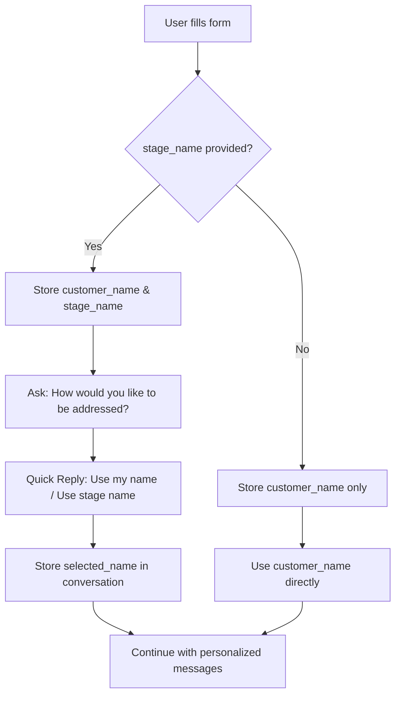

# Template 343 Fix Summary

## Problem Identified

Template 343 (Guitar Information Form) was missing critical fields from the original Python bot (`AH.py`), specifically the **stage_name** field that enables personalized name selection workflow.

## Root Cause

Both migration scripts created incomplete forms:
- **create_guitar_info_form_corrected.rb**
- **create_guitar_info_form_template.rb**

**Missing**: `stage_name` field at index [5]
**Impact**: Bot workflow broken - cannot ask users their preferred name (real name vs stage name)

## Original Python Bot Expectations (AH.py lines 973-990)

```python
def AHB1(usr):
    """ Step 2, Receiving name and sending Guitar ListPicker """
    dbLastMessage(usr.userId, "AHB1-wait")
    selection_json = usr.selection

    # Index [4]: customer_name
    updateName(usr.userId, selection_json[4]["items"][0]["value"])

    # Index [5]: stage_name (MISSING IN MIGRATION)
    try:
        stage_name = selection_json[5]["items"][0]["value"]
    except:
        stage_name = ""

    # If stage_name exists, trigger name preference workflow
    if stage_name != "":
        updateIntent(usr.userId, stage_name)
        sendMessage(AH_ID, usr.userId, "How would you like to be addressed?")
        typingStart(AH_ID, usr.userId)
        sendInteractive(AH_ID, usr.userId, "qr_name.json", usr.lang)
    else:
        AHB3(usr)
```

## Solution: Enhanced Form with Proper Keyboard Types

### New Script: `create_guitar_info_form_with_stage_name.rb`

**Key Improvements**:

1. ✅ **Added stage_name field** at index [5]
2. ✅ **Moved customer_email** to index [6]
3. ✅ **Added proper keyboard types** per Apple Messages specs
4. ✅ **Enhanced form** with additional useful fields

### Complete Field Structure

#### Page 1: Guitar Selection
- **guitar_model** (singleSelect with images)
  - Gibson Les Paul R8
  - Martin DC28E Dreadnought
  - Paul Reed Smith Custom

#### Page 2: Customer Information
| Index | Field | Type | Keyboard | Required | Notes |
|-------|-------|------|----------|----------|-------|
| 4 | customer_name | text | default | ✅ | Full name |
| 5 | **stage_name** | text | default | ❌ | **FIXED** - Artist/stage name |
| 6 | customer_email | email | emailAddress | ✅ | Email with @ and .com |
| 7 | customer_phone | text | phonePad | ❌ | Phone number keyboard |

#### Page 3: Guitar Details
| Field | Type | Keyboard | Required | Notes |
|-------|------|----------|----------|-------|
| serial_number | text | default | ❌ | Alphanumeric |
| guitar_year | text | numberPad | ❌ | Numeric keyboard |
| purchase_date | picker | date | ❌ | Date picker |
| purchase_price | text | decimalPad | ❌ | Decimal keyboard |

## Apple Messages Keyboard Types

### Supported Keyboard Types
```ruby
'keyboard_type' => 'default'        # Standard text keyboard
'keyboard_type' => 'emailAddress'   # Email keyboard with @ and .com
'keyboard_type' => 'phonePad'       # Phone number keyboard
'keyboard_type' => 'numberPad'      # Numeric keyboard (integers)
'keyboard_type' => 'decimalPad'     # Decimal number keyboard
'keyboard_type' => 'URL'            # URL keyboard with .com and /
```

### Benefits
- **Better UX**: Contextual keyboards for each field type
- **Faster input**: Users don't need to switch keyboards manually
- **Fewer errors**: Appropriate keyboard reduces input mistakes
- **iOS native**: Leverages platform capabilities

## Bot Workflow (Now Fully Functional)



### Workflow Steps

1. **Form Submission** → User completes Guitar Information Form
2. **Parse Response** → n8n "AHB1 - Parse Form Response" extracts:
   - `userName` from index [4]
   - `stageName` from index [5] ← **NOW WORKS**
3. **Conditional Logic** → If `stageName` exists:
   - Send: "How would you like to be addressed?"
   - Quick Reply options: "Use my name" | "Use stage name"
4. **Store Selection** → Save `selected_name` in conversation attributes
5. **Personalization** → Use `selected_name` in all subsequent messages

## n8n Workflow Integration

### Affected Nodes

**Already implemented in workflow** (just needed the form field):
- ✅ `AHB1 - Parse Form Response` (line 973-984)
- ✅ `AHB2 - Ask Name Preference` (line 1013-1019)
- ✅ `AHB2 - Name Selection Quick Reply` (line 1047-1053)
- ✅ `AHB2 - Select Name` (line 1066)
- ✅ `Update Name Attributes` (line 1113)
- ✅ `AHB3 - Personalized Greeting` (line 1149)

**No workflow changes needed** - just update template 343!

## Usage

### Create New Template (Recommended)
```bash
rails runner script/create_guitar_info_form_with_stage_name.rb \
  --account-id 1 \
  --inbox-id 6
```

### Update Existing Template 343
```bash
rails runner script/create_guitar_info_form_with_stage_name.rb \
  --account-id 1 \
  --inbox-id 6 \
  --template-id 343
```

### Test in n8n
1. Update "Form Direct Send" node to use new template ID
2. Test form submission with stage_name field
3. Verify "How would you like to be addressed?" quick reply appears
4. Confirm selected_name is stored correctly

## Verification Checklist

- [ ] Run migration script successfully
- [ ] Verify template has stage_name field at index [5]
- [ ] Test form submission in Apple Messages
- [ ] Confirm proper keyboards appear for each field:
  - [ ] Email field → emailAddress keyboard
  - [ ] Phone field → phonePad keyboard
  - [ ] Year field → numberPad keyboard
  - [ ] Price field → decimalPad keyboard
- [ ] Test stage_name workflow:
  - [ ] Submit form WITH stage_name
  - [ ] Verify quick reply appears
  - [ ] Select name preference
  - [ ] Confirm personalized greeting uses selected_name
- [ ] Test without stage_name:
  - [ ] Submit form WITHOUT stage_name
  - [ ] Verify flow continues to guitar list
  - [ ] Confirm customer_name is used

## Migration Impact

### Field Index Changes
```diff
  Index [4]: customer_name          ✅ UNCHANGED
- Index [5]: customer_email         ❌ MOVED
+ Index [5]: stage_name             ✅ ADDED
+ Index [6]: customer_email         ✅ NEW POSITION
+ Index [7]: customer_phone         ✅ ADDED
```

### Breaking Changes
⚠️ **None** - This is additive:
- Existing n8n workflow expects index [5] to be stage_name
- Adding the field makes the workflow functional
- No code changes required in n8n

## Related Files

### Scripts
- `/script/create_guitar_info_form_with_stage_name.rb` - **NEW** Fixed version
- `/script/create_guitar_info_form_corrected.rb` - Old (missing stage_name)
- `/script/create_guitar_info_form_template.rb` - Old (missing stage_name)

### Original Source
- `/_apple/Acoustic-House-Bot-origin/acoustichouse/AH.py` - Python bot source
  - Lines 973-990: AHB1 function showing expected field structure

### n8n Workflow
- `/n8n-flows/fixed-workflow-correct-Switch.json` - Switch-based workflow
  - Already has stage_name handling logic
  - Just needs form template to match

### Documentation
- `/docs/apple-messages/TEMPLATE_343_FIX_SUMMARY.md` - This document

## Additional Benefits

Beyond fixing the missing field, this update provides:

1. **Enhanced UX**: Proper keyboard types for better user experience
2. **Complete Contact Info**: Added phone number field
3. **Better Guitar Details**: Added year and price fields with proper keyboards
4. **Descriptions**: Added helpful descriptions for optional fields
5. **Validation**: Proper required/optional field marking
6. **Maintainability**: Clear comments explaining field indices

## Success Criteria

✅ Template 343 updated with complete field structure
✅ stage_name field at correct index [5]
✅ Proper keyboard types for all fields
✅ Bot workflow executes complete name preference flow
✅ Personalized greetings use selected_name
✅ No breaking changes to existing functionality

---

**Status**: ✅ **READY FOR DEPLOYMENT**

Run the migration script with `--template-id 343` to update existing template or without to create new enhanced template.
